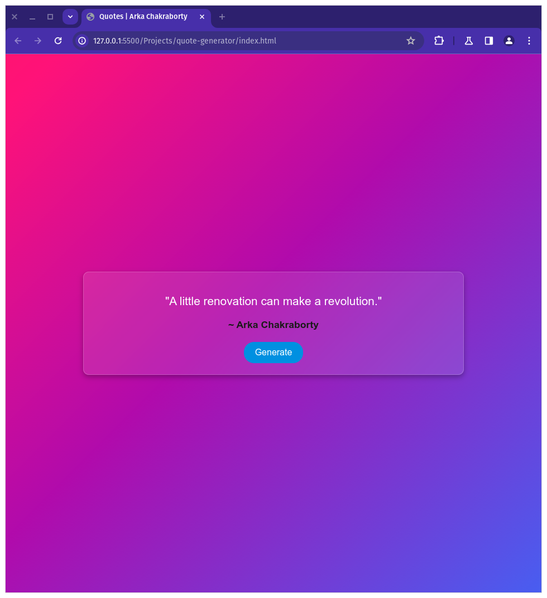
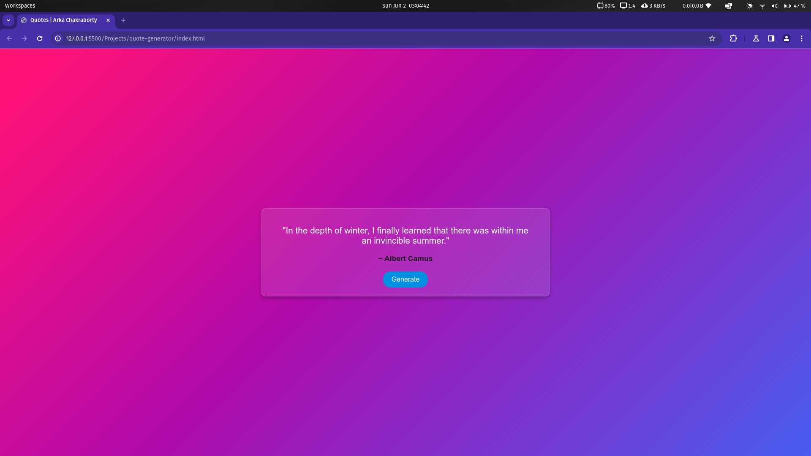
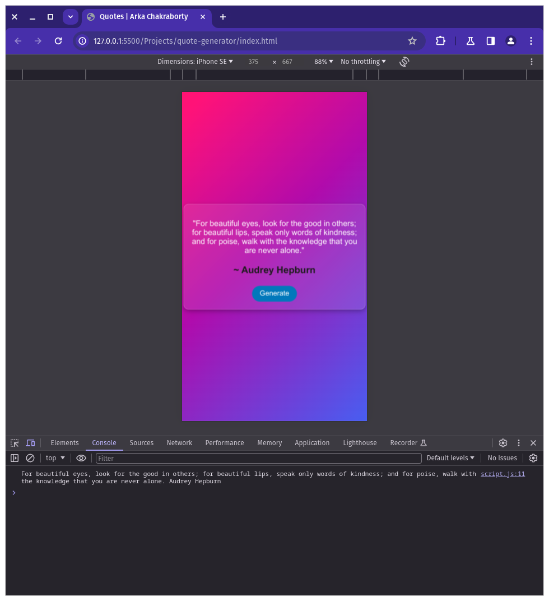

<h1>Quote Generator</h1>

A responsive website that generates random quotes using the Quotable API. This project uses Apple's system font for a sleek, modern appearance and is fully responsive to ensure a great user experience on all devices.

Click the link below to experience the magic yourself and start your day with a dose of inspiration! 💬
https://dark-programer.github.io/inspire-me

<h2>Features</h2>
    <ul>
        <li><strong>Random Quotes</strong>: Fetches random quotes from the Quotable API.</li>
        <li><strong>Responsive Design</strong>: Optimized for viewing on devices of all sizes.</li>
        <li><strong>Modern Aesthetic</strong>: Utilizes Apple's system font and a glassmorphism design for a visually appealing interface.</li>
    </ul>
    
<h2>Technologies Used</h2>
    <ul>
        <li>HTML5</li>
        <li>CSS3</li>
        <li>JavaScript</li>
        <li>Quotable API: <a href="https://api.quotable.io/random" target="_blank">https://api.quotable.io/random</a></li>
    </ul>
    
<h2>Getting Started</h2>
    
<h3>Prerequisites</h3>
    
Ensure you have a modern web browser installed.

    
<h3>Installation</h3>
    <ol>
        <li>Clone the repository:</li>
        <pre><code>git clone https://github.com/Dark-Programer/inspire-me.git</code></pre>
        <li>Navigate to the project directory:</li>
        <pre><code>cd inspire-me</code></pre>
    </ol>
    
<h3>Usage</h3>
    <ol>
        <li>Open the <code>index.html</code> file in your web browser.</li>
        <li>Click the "Generate" button to fetch a random quote.</li>
    </ol>
    
<h2>Files</h2>
    <ul>
        <li><code>index.html</code>: The main HTML file.</li>
        <li><code>style.css</code>: The CSS file for styling the website.</li>
        <li><code>script.js</code>: The JavaScript file for fetching quotes from the API.</li>
    </ul>

<h2>Screenshots</h2>

  
  
  

<h2>Author</h2>
    
Arka Chakraborty

    
<h2>Customization</h2>
    <ul>
        <li><strong>Background Gradient</strong>: The background gradient can be customized in the <code>style.css</code> file.</li>
        <li><strong>Font</strong>: The project uses Apple's system font by default, but you can customize it in the <code>style.css</code> file by changing the <code>font-family</code> property.</li>
    </ul>
    
<h2>Contributing</h2>
    
Contributions are welcome! Please fork the repository and submit a pull request.

    
<h2>Contact</h2>
    
For any inquiries, please contact <a href="mailto:arkachakrabortythedark006@gmail.com">arkachakrabortythedark006@gmail.com</a>

